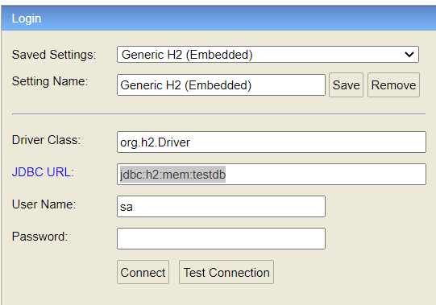
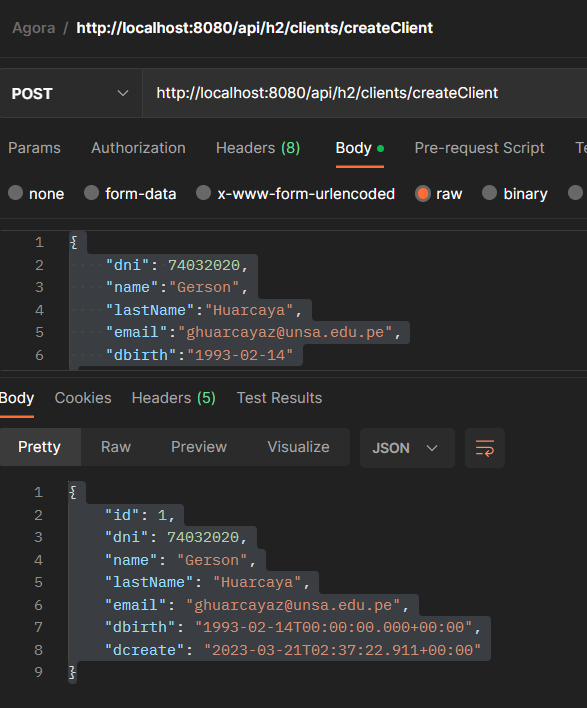

# Reto-Backend-20-03-2023

## Microservicio CRUD Customers

### Tecnologías utilizadas

* Lenguaje de programación: Java 11
* Framework : Spring, Swagger
* Base de datos: H2(Local)

### Requisitos previos

#### Postman
* Agregar el collection adjunto en el repositorio en la carpeta resources
* Ahí se encuentras todos los accesos con ejemplos de los endpoints creados
para el test
* Al ser una BD local se deberan crear varios usuarios para probar todo
#### Urls
* [h2-console](http://localhost:8080/h2-console/)
Driver Class : org.h2.Driver,
JDBC URL : jdbc:h2:mem:testdb

* [Swagger](http://localhost:8080/swagger-ui/index.html)

### Instalación
* Clonar el repositorio de GitHub:
* [link](https://github.com/characatope/Reto-Backend-20-03-2023)
* cargar las dependencias de maven y correr en intellij idea

### Endpoints
#### POST /createClient: 
* Crea un nuevo cliente.

#### GET /getClients: 
* Devuelve una lista de todos los clientes.
#### GET /client/dni/{dni}:
* Devuelve el cliente con el dni especificado.
#### GET /client/email/{email}: 
* Devuelve el cliente con el email especificado.
#### GET /client/month/{month}:
* Devuelve la cantidad de clientes que nacieron el mes especificado.
#### GET /client/month/more:
* Devuelve el mes que nacieron más clientes.
#### GET /client/month/less:
* Devuelve el mes que nacieron menos clientes.
#### GET /client/year/more: 
* Devuelve el año que nacieron más clientes.
#### GET /client/year/less: 
* Devuelve el año que nacieron menos clientes.
#### GET /client/birthrateByMonth: 
* Devuelve la taza de natalidad por mes de los clientes registrados.

## Ejemplo:

* Url: http://localhost:8080/api/h2/clients/createClient
* Body:
`  {
  "dni": 74032020,
  "name":"Gerson",
  "lastName":"Huarcaya",
  "email":"huarcaya@unsa.edu.pe",
  "dbirth":"1993-02-14"
  }`

* Respuesta:

`{
"id": 1,
"dni": 74032020,
"name": "Gerson",
"lastName": "Huarcaya",
"email": "ghuarcayaz@unsa.edu.pe",
"dbirth": "1993-02-14T00:00:00.000+00:00",
"dcreate": "2023-03-21T02:37:22.911+00:00"
}`
